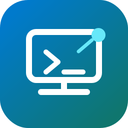

<div align="center">
  
  <h1>vscodeserver</h1>
  <p>Launch VS Code Web on a Mac over Tailscale, keep it alive in tmux, open it from an iPad or another trusted device.</p>

  <p>
    
    
    
    
    
  </p>
</div>

---

`vscodeserver` is a tiny launcher for `code serve-web`. It binds VS Code Web to the Mac's Tailscale IP, runs it inside a named `tmux` session, and gives you one stable command for start/status/url/attach/logs/stop.

It is useful when your Mac is the real development machine and your iPad or laptop is just the browser terminal.

## Features

| | |
|---|---|
| **Tailscale-only bind** | Uses the Mac's Tailnet IP instead of `0.0.0.0` |
| **tmux lifecycle** | Keeps VS Code Web running after SSH/browser disconnects |
| **Stable project entry** | Defaults to `~/dev`; override with config or CLI arg |
| **Simple status** | Shows folder, port, URL, tmux state, and listener process |
| **Safe stop** | Stops the tmux session and only kills VS Code Web listeners |
| **No daemon magic** | Plain shell script, user config, no global service required |

## Quick install

```bash
curl -fsSL https://raw.githubusercontent.com/antonboehner/vscodeserver/main/install.sh | bash
```

Or, if you prefer no curl-pipe:

```bash
git clone https://github.com/antonboehner/vscodeserver.git ~/.local/src/vscodeserver && ~/.local/src/vscodeserver/install.sh
```

## Requirements

- macOS
- VS Code with the `code` command installed
- Tailscale running on the Mac and client device
- `tmux`
- `zsh`

## Install

```bash
./install.sh
```

This installs:

```text
~/bin/vscodeserver
~/.local/bin/vscodeserver -> ~/bin/vscodeserver
~/.config/vscodeserver/config
```

Optional: if you want the installer to create `~/dev` as a symlink, pass a target:

```bash
VSCODE_SERVER_DEV_ROOT=/Volumes/Projects/dev ./install.sh
```

Otherwise create or manage `~/dev` yourself.

## Usage

```bash
vscodeserver start [folder]
vscodeserver status
vscodeserver url
vscodeserver attach
vscodeserver logs
vscodeserver stop
vscodeserver restart [folder]
vscodeserver config
```

Default start:

```bash
vscodeserver start
```

Open a specific folder:

```bash
vscodeserver restart ~/dev/my-project
```

Print only the browser URL:

```bash
vscodeserver url
# http://100.x.y.z:8001
```

## Configuration

Config lives at:

```text
~/.config/vscodeserver/config
```

Example:

```bash
DEFAULT_FOLDER="$HOME/dev"
PORT=8001
SESSION="vscode-server"
TAILSCALE_BIN="/Applications/Tailscale.app/Contents/MacOS/Tailscale"
```

Environment variables override config for one run:

```bash
VSCODE_SERVER_PORT=8010 vscodeserver start ~/dev/my-project
```

## Security model

The default is designed for a private Tailnet:

```text
host:  Mac Tailscale IP only
port:  8001
auth:  no VS Code connection token
```

No token means any trusted device/user in that Tailnet that can reach the Mac and port can open the editor. If your Tailnet includes untrusted devices or users, use stricter Tailscale ACLs or a different auth model.

Do not expose this on a public interface.

## Docs

- [`docs/installation.md`](docs/installation.md)
- [`docs/config.md`](docs/config.md)
- [`docs/usage.md`](docs/usage.md)
- [`docs/security.md`](docs/security.md)
- [`docs/paths.md`](docs/paths.md)
- [`docs/tmux.md`](docs/tmux.md)
- [`docs/extensions.md`](docs/extensions.md)

## License

MIT
